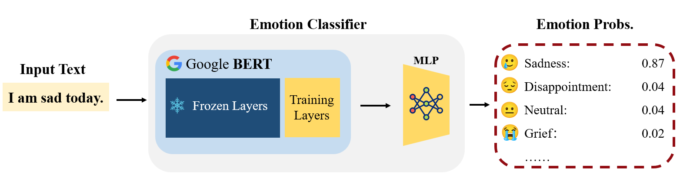
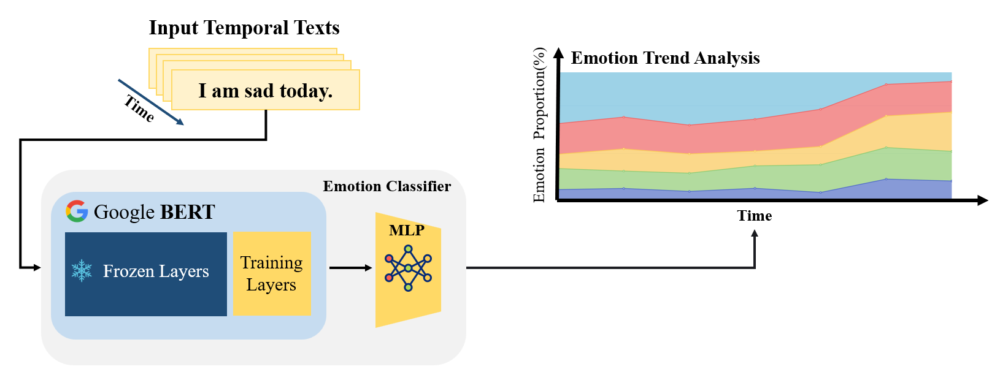
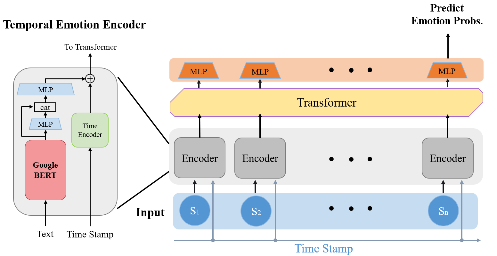
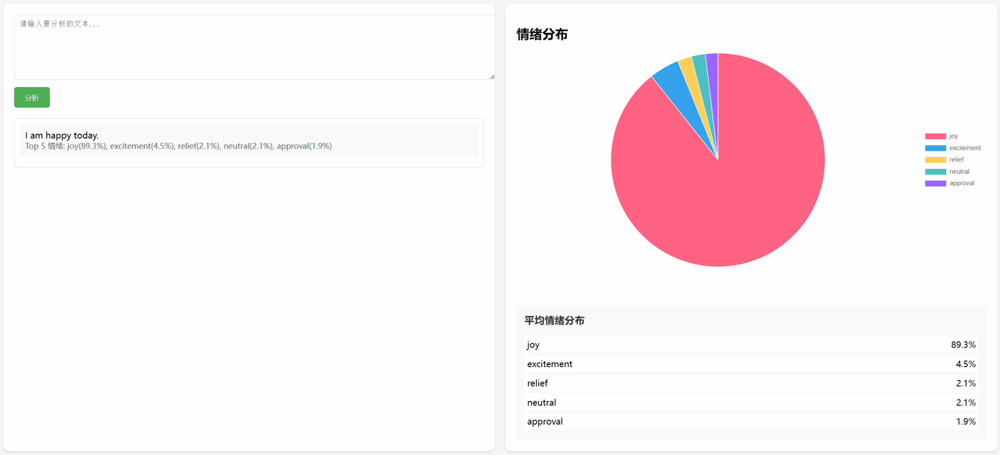

<h1 align="center"> EmotionPulse </h1>

<p align="center">
    <a href="[https://github.com/despzcm/EmotionPulse]">  </a>
</p>

<div align="center">
  
</div>

<p align="center">
 Temporal Emotion Analysis and Prediction across Communities
</p>


## 🔍 Project Overview
This project focuses on Emotion analysis and prediction, with the following main components:
- **Single-sentence Emotion classification**: Determining the emotion polarity of individual sentences.
- **Temporal Emotion trend analysis**: Analyzing how emotion evolves over time within a sequence of texts.
- **Temporal Emotion prediction**: Forecasting future sentiment based on historical emotion data.
- **Web scraping and sentiment analysis**: Collecting and analyzing emotion from selected posts on Reddit and Shui yuan(水源) communities.








## 🚀 Quick Start
Version Compatibility

- Python >= 3.10
- Python 3.10-3.11 is recommended for best compatibility 

1. Install all dependencies using pip:
```bash
pip install -r requirements.txt
```

2. **NLTK Data Download**: First-time users need to download NLTK data
```python
import nltk
nltk.download('stopwords')
```

3. **Model**: Download the necessary model from [here](https://pan.sjtu.edu.cn/web/share/18801724bfc11ef663aa64ac61102485) and put them in the `model` folder

4. **Reddit API**: To use the Reddit crawler functionality, please configure your Reddit API credentials in `config.py`

5. **Shuiyuan Cookies**：Put your shuiyuan cookie in the `cookies.txt` file.

6. **Baidu Translator API**: To use the Baidu Translator API, please configure your Baidu Translator API credentials in `translationAPI`

## 📽️ Demo

 **Run the code**:
```bash
python web_backend.py
```

